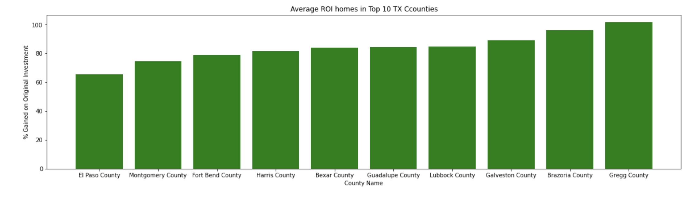

# Zillow-Research-Analysis
by: Armun Shakeri

### Overview and Business Problem

The goal of this analysis is to identify the top 5 zipcodes for our client to invest in. The team is not familiar with the Texas housing market therefore we will incorporate coefficients of variance to help filter most risk appropriate counties. The results from this analysis will provide them with the forecast of the next 10 year mean house value in the top 5 ZipCodes as well as ROI in 1 year, 3 years, 5 years, and 10 years.

### Data

The dataset for this analysis was gathered from Zillow Research, and contains median home sales price in 1,293 individual ZipCodes from 2000-01-31 to 2022-08-31. Each row represents a unique ZipCode indexed with RegionID, and contains other location info as well as median housing sales price for each month. 

### Methods and Analysis

To begin analysis we first calculated the average ROI for all counties in Texas and narrowed the list down to the top 10 ZipCodes by selecting the top ZipCodes with highest average ROI in each county. To be mindful of black swan events such as housing bubbles and recessions we used the coefficient of variation to take risk into consideration. This technique is very common within finance to determine how much volatility is assumed in comparison with the amount of return expected from the investments. We also selected data in the top 30-70 quartiles to add some variation. 

For prediction we ran 3 models, Random Walk, ARIMA, and SARIMAX. Out of the three we selected the SARIMAX model which performed the best to forecast the average predicted home values for each of the top 10 ZipCodes for the next 10 years. 

### Conclusion

Based on our analysis, our results show that these 5 zipcodes have the best ROI:

**1) ZipCode 78229 Bexar County - San Antonio (10 years):**
Total Expected ROI in 1 year: 2.73%
Total Expected ROI in 3 year: 8.16%
Total Expected ROI in 5 year: 13.58%
Total Expected ROI in 10 year: 26.8%

**2) ZipCode 77471 Fort Bend County - Rosenberg (10 years):**
Total Expected ROI in 1 year: 2.69%
Total Expected ROI in 3 year: 8.08%
Total Expected ROI in 5 year: 13.46%
Total Expected ROI in 10 year: 26.68%

**3) ZipCode 79902 El Paso County - El Paso (3 years):**
Total Expected ROI in 1 year: 4.61%
Total Expected ROI in 3 year: 10.09%
Total Expected ROI in 5 year: 12.77%
Total Expected ROI in 10 year: 14.9%

**4) ZipCode 77546 Galveston County - Friendswood (10 years):**
Total Expected ROI in 1 year: 2.62%
Total Expected ROI in 3 year: 7.86%
Total Expected ROI in 5 year: 13.09%
Total Expected ROI in 10 year: 25.96%

**5) ZipCode 77532 Harris County - Crosby (10 years):**
Total Expected ROI in 1 year: 2.39%
Total Expected ROI in 3 year: 6.85%
Total Expected ROI in 5 year: 11.24%
Total Expected ROI in 10 year: 21.73%

### Next Steps

1) This project focused solely on past home values to make predictions for the next 10 years. We can make the analysis more meaningful by incorporating factors such as population, school rankings, crime rate, and property size.

2) We can remove coefficients of variance to have counties such as Dallas and Tarrant county included in analysis.

## Repository Structure

├── Data
├── Images
├── Analysis.ipynb
├── Presentation4.pdf 
├── README.md 